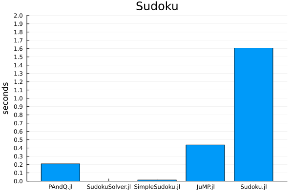

# Benchmarks

This benchmark measures encoding, solving, and decoding a single solution to Sudoku. The times are given by the median of ten samples using BenchmarkTools.jl. Each package may have multiple implementations, so the minium time of those is used. The implementation for PAndQ.jl corresponds to that of the [Sudoku](@ref) tutorial. The implementation for JuMP.jl is taken from their [tutorial](https://jump.dev/JuMP.jl/stable/tutorials/linear/sudoku/) with minor modifications to satisfy the requirements of the benchmark.

See also the [repository benchmarks folder](https://github.com/jakobjpeters/PAndQ.jl/tree/main/benchmarks).

